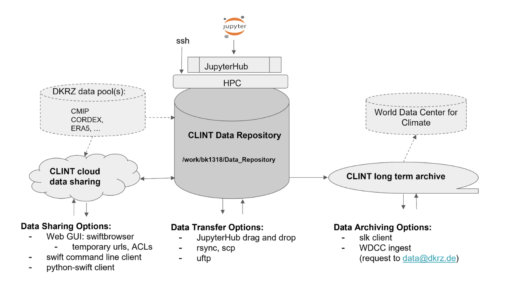

# CLINT Data Repository

Example Data Repository for Clint project.

This project has some example notebooks to show the usage of intake to access the data pool at DKRZ.

You can use the notebooks and the data pool via the Jupyter Hub at DKRZ:

https://jupyterhub.dkrz.de/

## Overview

* Root folder: `/work/bk1013/Data_Repository`
* 60 TB
* additinal 30 GB for each user

See 

## Links

* https://luv.dkrz.de/
* https://docs.dkrz.de/
* https://docs.dkrz.de/doc/dataservices/finding_and_accessing_data/index.html
* https://jupyterhub.dkrz.de/
* https://nextcloud.dkrz.de/
* https://tutorials.dkrz.de
* https://tutorials.dkrz.de/tutorial_intake-1-introduction.html
* https://gitlab.dkrz.de/data-infrastructure-services/tutorials-and-use-cases
